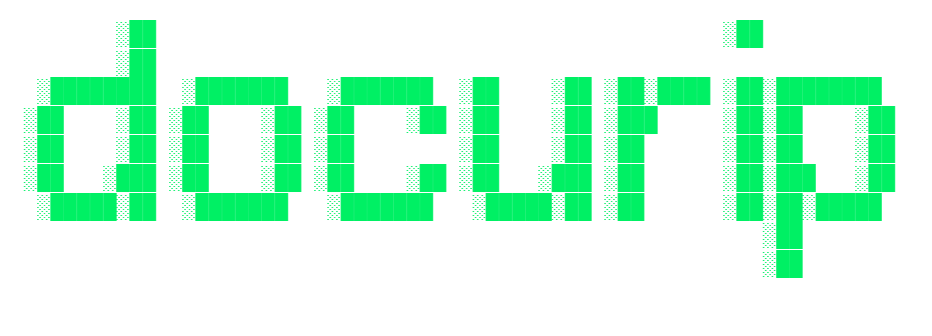
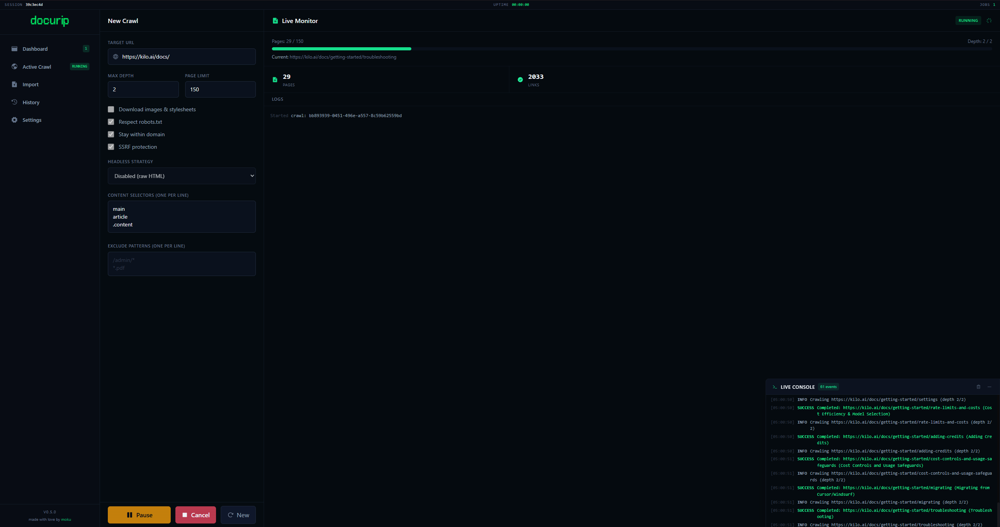
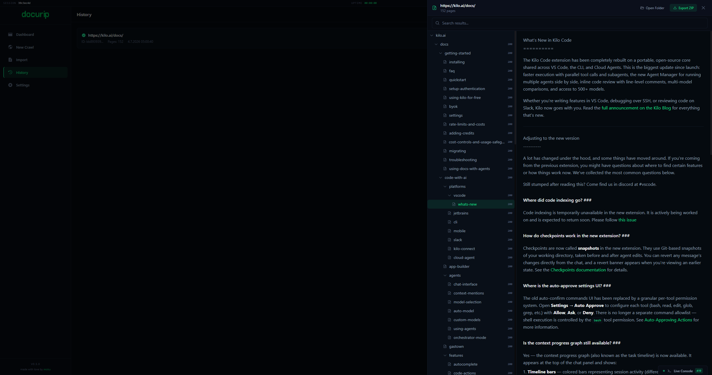
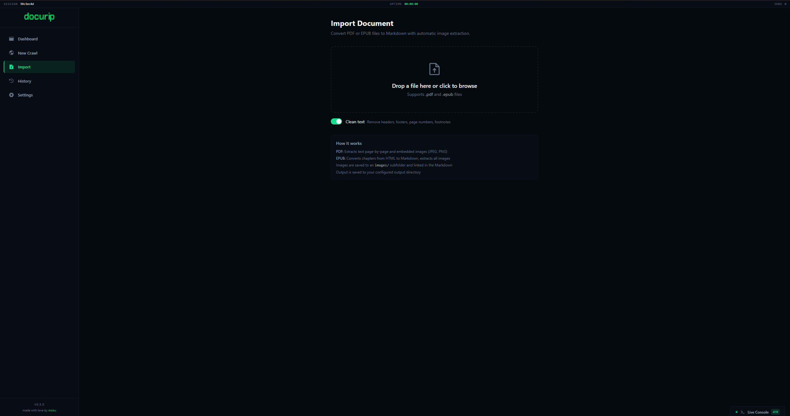

<a id="readme-top"></a>

<div align="center">
  <a href="https://docurip.moku.cx">
    
  </a>

  <h2><strong>RAG-Ready Markdown in Minutes. Slash LLM Token Costs by 90%.</strong></h2>

  <p>Engineered for solo developers, RAG builders, and AI engineers. Mirror any docs site or local PDF/EPUB as clean, searchable, model-ready Markdown instantly.</p>

  <p>
    <a href="https://docurip.moku.cx/download.html"><strong>Download free »</strong></a>
    ·
    <a href="https://docurip.moku.cx/#features">Explore features</a>
    ·
    <a href="https://docurip.moku.cx/documentation.html">Documentation</a>
    ·
    <a href="CHANGELOG.md">Changelog</a>
    ·
    <a href="https://github.com/MokuDev/docurip/issues">Report bug</a>
  </p>

  <br />

  [](CHANGELOG.md)
  [](LICENSE)
  [](https://docurip.moku.cx/download.html)
  [](https://www.rust-lang.org/)
  [](https://tauri.app/)
  [](https://github.com/MokuDev/docurip/stargazers)
</div>

---

## Why docurip?

If your goal is LLM training, fine-tuning, or RAG, **raw HTML is your enemy. Clean Markdown is your secret weapon.**

### The Scraper's Nightmare
- **Fragile Custom Scrapers:** Spending hours writing custom scripts, handling rate limits, and battling pagination just to read a docs site.
- **Boilerplate Token Waste:** Wasting up to 90% of your context window and API billing on header links, navbars, sidebars, and footer scripts.
- **Ruined RAG Quality:** Standard text splitters break code blocks and ignore header hierarchy, ruining your vector retrieval accuracy.
- **Privacy Violations:** Sending local files or internal documentation to third-party cloud scrapers just to get clean text back.

### The Savior
**Docurip solves this once and for all.** It's a native desktop application that crawls entire documentation websites, extracts only the semantic content, and converts it into structured, RAG-ready Markdown—all locally, in seconds, and completely free. No SaaS fees, no API keys, and no data leaks.

```
RAW HTML        12,000 tokens/page   ████████████████████  100%
CLEAN MARKDOWN   5,000 tokens/page   ████████             40%  — 60% saved
```

| | |
|---|---|
| **Up to 60% fewer tokens** | HTML boilerplate stripped entirely — 12M tokens of raw docs shrinks to 5M tokens of clean Markdown |
| **58% cheaper API calls** | Pay less for embeddings, fine-tuning, context window storage, and batch inference |
| **2.5× faster processing** | 1,000 HTML pages at 100k t/s: 120 s raw vs. 50 s clean Markdown |
| **50–75% less disk space** | 1 GB HTML archive → 250–500 MB; redundant scripts and styling gone |
| **Up to 12.6× with prompt caching** | Load clean MD once, cache it, subsequent reads cost 90% less |

### Better for training & RAG

When an LLM trains on raw HTML, it wastes capacity learning layout noise (`<div class="admonition">`, CSS classes, navigation). Clean Markdown gives models **100% signal** — code blocks, APIs, headers.

For RAG, standard text splitters break arbitrarily on HTML tags, splitting code blocks mid-syntax. Markdown-based splitting natively understands document headers, keeping methods and descriptions in a single context block — better embeddings, more accurate retrieval.

**Real-world benchmark — complete Python documentation:**
`~35M tokens (Markdown)` vs. `~80M tokens (HTML)` — **55% less overhead, 2.2× faster** processing, zero layout noise.

**React.dev example:** a single page goes from `42,300 tokens` (raw HTML with nav, sidebar, hydration scripts) to `4,800 tokens` (semantic Markdown). Across 200 pages with prompt caching: `200 × 5K × 1.9 = 1.9M tokens` vs. `60M` raw.

<p align="right">(<a href="#readme-top">back to top</a>)</p>

---

## Screenshots

<div align="center">
  
  
  
  
</div>

<p align="right">(<a href="#readme-top">back to top</a>)</p>

---

## Features

### Zero Context-Loss thanks to Parallel Crawling & Headless Chrome

Set a start URL, crawl depth, and page limit. Docurip walks the site in parallel via an async I/O pool, respects `robots.txt` by default, and spins up headless Chrome on demand for JS-rendered apps.

| | |
|---|---|
| **Parallel fetching** | Semaphore-bounded concurrency (configurable, default 3) with a shared `reqwest` connection pool |
| **Headless Chrome** | On-demand for CSR apps (VitePress, Docusaurus, Nextra); strategies: `never`, `auto`, `always` |
| **robots.txt compliance** | Fetches and parses `/robots.txt`, honors `User-agent`, `Disallow`, `Allow`, `Crawl-delay` — built-in |
| **Domain-locked** | Never wanders off-site — `stayWithinDomain` enforced by default |
| **Pause / Resume / Cancel** | Soft-pause via atomics — in-flight requests finish gracefully before stopping |
| **Smart content extraction** | Auto-detects `<main>`, `<article>`, `[role="main"]` — strips nav, sidebar, footer, and UI chrome |
| **Markdown deduplication** | Removes duplicate content blocks, TOC navigation, and trailing heading stubs |
| **Automatic retry** | Exponential backoff for transient errors (timeouts, 5xx); permanent errors (4xx) fail immediately |
| **Disk-error auto-pause** | Detects permission errors, full disks, read-only filesystems — pauses so you can fix and resume |
| **Crawl profiles** | Pre-configured presets for API Docs, Wiki, Blog, Documentation — sensible defaults in one click |

### Watch the Crawler Walk the Tree with Real-Time Monitoring

An integrated console drawer streams every fetch request, network connection, and file write as it happens.

- **Live velocity speedometer** — pages/min updated in real time
- **Streaming console logger** — color-coded `✅` success · `⚠️` warning · `❌` error with typed error icons
- **Pause / Resume / Retry / Cancel** — full control without restarting

### Instant RAG Ingestion thanks to a Virtualized Tree & Debounced Search

Built-in debounced full-text search finds files by content. A sandboxed preview pane renders Markdown with syntax-highlighted code blocks, sanitized through DOMPurify.

- **Instant full-text search** — 300 ms debounce, weighted by title (10×), URL (5×), content
- **Sandboxed Markdown preview** — DOMPurify sanitized, `javascript:` URIs blocked, lazy-loaded
- **Virtualized file tree** — windowed rendering for archives with thousands of pages
- **Hierarchical navigation** — collapsible tree mirroring the site's URL structure

### 100% Secure & Behaving thanks to local Safety Systems

> Engineered to protect your network, respect targets, and safeguard local disk space.

| | |
|---|---|
| **Domain Lock** | Locks crawling to your target host — never drifts into ad networks, vendor blogs, or partner sites |
| **SSRF Protection** | Blocks localhost, RFC 1918 private ranges, link-local, IPv6 ULA, and `.local` TLD — at launch and on every discovered link |
| **Hardened CSP** | No `unsafe-inline` scripts; HTML sanitized through DOMPurify; preview pane sandboxed |
| **Disk Guard** | Pauses on disk full, permission denied, or read-only errors — fix the issue, hit Resume, keep your progress |
| **Asset safety** | 50 MB size cap, MIME-type allow-list, path sanitization, directory-traversal prevention |

### Unified PDF & EPUB Conversion thanks to a Boilerplate-Stripping Importer

Docurip isn't limited to websites. Drop a PDF or EPUB onto the Import view and docurip extracts text and images into a Markdown archive, ready for the same export pipeline as crawled content.

| | |
|---|---|
| **PDF import** | Extracts text per page, splits into individual Markdown files, pulls embedded images |
| **EPUB import** | Converts each chapter's HTML to Markdown, extracts cover and inline images |
| **Text cleaner** | Strips repeated headers/footers, page numbers, footnotes — cross-page frequency analysis, toggle per import |
| **Native drag & drop** | Tauri-native file drop — reliable file handling, no HTML5 drag events |

### Slash LLM Token Overhead by ~90% thanks to a Boilerplate-Stripping Export Pipeline

No proprietary database. Docurip exports documentation exactly how you want it. One click compiles your archive with automatic link rewriting so all internal references work offline.

| Format | Description |
|--------|-------------|
| **MD Files** | Individual `.md` files with automatic link rewriting — all internal refs work offline |
| **Merged MD** | All pages as one file — RAG-ready, load once into LLM context, `---` separators are natural chunk boundaries |
| **JSON Files** | Structured JSON per page with `title`, `url`, `content`, and `meta` fields |
| **Merged JSON** | All pages as a single JSON array — ready for programmatic consumption |
| **HTML Files** | Standalone HTML per page with embedded styling |
| **Merged HTML** | All pages as a single HTML document |
| **PDF Files** | Per-page PDF via headless Chrome *(requires `--features headless`)* |
| **Merged PDF** | All pages as a single searchable PDF *(requires `--features headless`)* |
| **ZIP** | Full output archive with asset deduplication & hashing |

<p align="right">(<a href="#readme-top">back to top</a>)</p>

---

## Getting Started

### Download (recommended)

Grab the latest Windows installer — **free, no account required**:

**👉 [Download docurip](https://docurip.moku.cx/download.html)**

### Build from source

**Prerequisites:** Rust 1.95+, Node.js 22+, Windows with WebView2 (bundled with modern Windows)

```bash
git clone https://github.com/MokuDev/docurip
cd docurip
npm install

# Development (hot-reload)
npm run tauri dev

# Production build
npm run tauri build

# With headless Chrome — enables JS-rendered fetching and PDF export
npm run tauri build -- --features headless
```

**Linux build prereqs:** `libgtk-3-dev libwebkit2gtk-4.1-dev libjavascriptcoregtk-4.1-dev libsoup-3.0-dev libayatana-appindicator3-dev`

<p align="right">(<a href="#readme-top">back to top</a>)</p>

---

## Usage

### 1. Configure Settings

Before your first crawl, open **Settings** and set:
- **Output directory** — where crawled content is saved (default: `~/.docurip`)
- **Concurrency** — parallel requests (lower if you hit 429s)
- **Request delay** — milliseconds between requests (raise for rate-limited hosts)

### 2. Start a Crawl

Go to **New Crawl**, pick a profile (API Docs / Wiki / Blog / Documentation / Custom), paste a docs URL, tune depth/page limits, and click **Start Crawl**.

The live console shows each page in real time. Use **Pause** if you see a spike of rate-limit errors, wait a moment, then **Resume**.

### 3. Import Files (optional)

Go to **Import**, drag a PDF or EPUB onto the drop zone. Enable **Clean text** to strip headers, footers, page numbers, and footnotes. The imported content appears as a Markdown archive — same as crawled content.

### 4. Browse & Export

In **History**, select any completed job to:
- **Browse Results** — search and preview all captured pages
- **Export** — choose a format; output lands automatically in the job's folder
- **Open Output Folder** — opens the `main/` subfolder directly in Explorer

### Output folder layout

```
~/.docurip/
└── {domain}/
    ├── main/       ← crawled Markdown + downloaded assets
    ├── zip/        ← ZIP archives
    └── formats/    ← MD · HTML · PDF · merged exports · JSON
```

<p align="right">(<a href="#readme-top">back to top</a>)</p>

---

## Recipes

### LLM / RAG context

```
Crawl docs site → Export as Merged MD → paste into LLM context or load into your RAG pipeline
```

The `---` separators between pages are natural chunk boundaries for text splitters. Clean Markdown cuts token usage by ~58% vs. raw HTML and keeps code blocks intact.

**With Anthropic Prompt Caching:** load the Merged MD once, cache it, pay ~90% less on every subsequent read. At 1,000 pages, that's `120M tokens (raw HTML, 10 queries)` → `9.5M tokens` — a **12.6× reduction**.

### PDF / EPUB to LLM-ready Markdown

```
Import PDF or EPUB → text cleaner strips artifacts → Export as Merged MD or JSON
```

Drop a technical manual, ebook, or whitepaper into the Import view. The text cleaner removes repeated headers/footers, page numbers, and footnotes. Export as JSON for programmatic access or Merged MD for direct LLM context.

### Large sites (500+ pages)

```
Profile: Documentation  |  Concurrency: 8  |  Request delay: 200 ms  |  Max depth: 3  |  Page limit: 500
```

If you see 429 errors, lower concurrency to 2 and raise the delay to 1000 ms. Scope first with a shallow `pageLimit: 50` crawl, then scale up.

### JS-rendered docs (VitePress, Docusaurus, Nextra)

Build with `--features headless` and set **Headless Strategy** to `always`. Expect ~5–10× slower throughput — keep concurrency at 2–3.

### Offline PDF archive

Crawl the site, then **Export → Merged PDF**. One searchable PDF containing all pages. Requires the headless build.

<p align="right">(<a href="#readme-top">back to top</a>)</p>

---

## Tech Stack

| Layer | Technology |
|-------|-----------|
| Backend | Rust 1.95+, Tauri v2, tokio, reqwest, scraper, html2md, pulldown-cmark, pdf-extract, epub |
| Frontend | React 19, TypeScript 5, Vite 6, Tailwind CSS 3.4, framer-motion, react-window |
| Tauri Plugins | shell, fs, dialog, store, updater |
| System | sysinfo, uuid, DOMPurify |
| Optional | headless_chrome (behind `--features headless`) |

<p align="right">(<a href="#readme-top">back to top</a>)</p>

---

## Roadmap

- [x] **v0.4** — Foundations: stability, test coverage, memory bounds, backpressure
- [x] **v0.5** — Import & Export: PDF/EPUB → Markdown, JSON/HTML export, crawl profiles, text cleaning, virtualized tree
- [ ] **v0.6** — UX & Automation: scheduled crawls, URL rules, full-text search improvements, optional OCR
- [ ] **v0.7** — Distribution: robust installer, auto-updater, macOS/Linux build preparation
- [ ] **v1.0** — CLI mode, 5k-page crawls, stable release

Full plan in [ROADMAP.md](ROADMAP.md). See the [open issues](https://github.com/MokuDev/docurip/issues) for proposed features and known issues.

<p align="right">(<a href="#readme-top">back to top</a>)</p>

---

## Contributing

Issues and pull requests are welcome. Please run `cargo test` and `npm run lint` before opening a PR.

1. Fork the Project
2. Create your Feature Branch (`git checkout -b feature/AmazingFeature`)
3. Commit your Changes (`git commit -m 'Add some AmazingFeature'`)
4. Push to the Branch (`git push origin feature/AmazingFeature`)
5. Open a Pull Request

<p align="right">(<a href="#readme-top">back to top</a>)</p>

---

## License

Distributed under the MIT License — see [LICENSE](LICENSE).

<p align="right">(<a href="#readme-top">back to top</a>)</p>

---

## Contact

**moku** — [@mokudev](https://x.com/mokudev) · [moku.cx](https://moku.cx)

Project Link: [https://github.com/MokuDev/docurip](https://github.com/MokuDev/docurip) · Website: [docurip.moku.cx](https://docurip.moku.cx)

<p align="right">(<a href="#readme-top">back to top</a>)</p>

---

<div align="center">
  <strong>Ready to rip?</strong><br />
  Free forever · No account required · Open-core<br /><br />
  <a href="https://docurip.moku.cx/download.html"><strong>Download docurip »</strong></a>
  <br /><br />
  Made with 💚 by <a href="https://moku.cx">moku</a>
</div>
