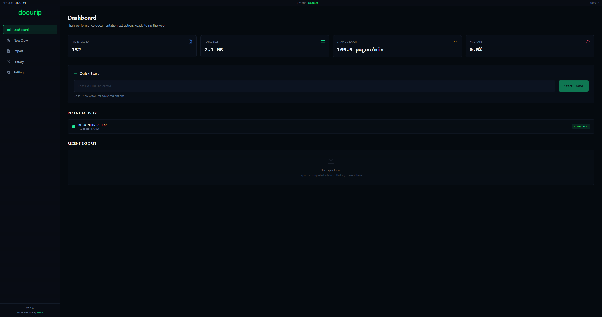
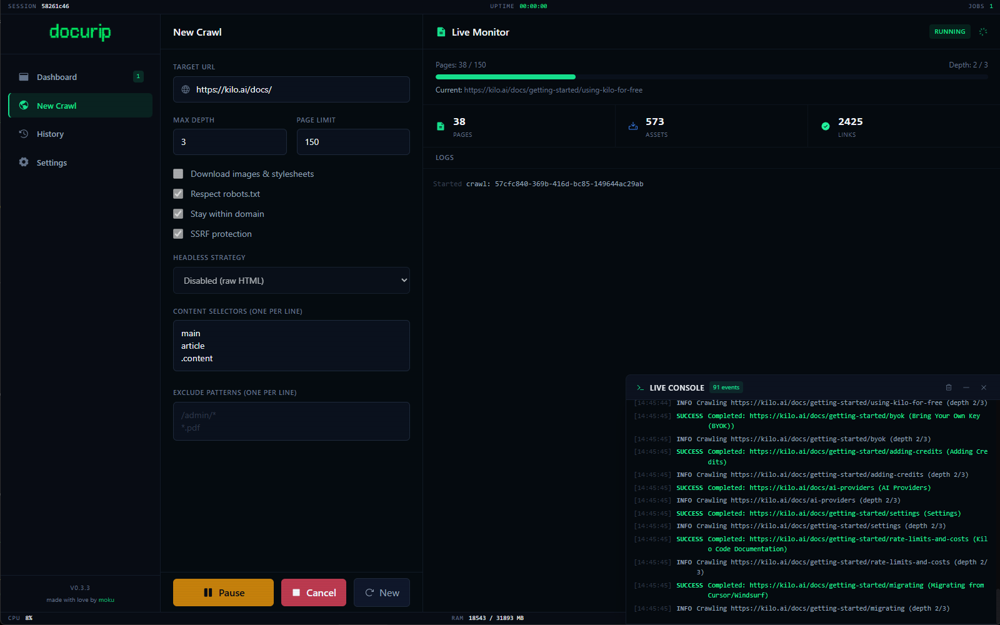
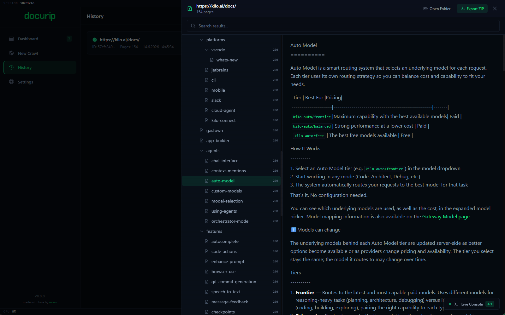
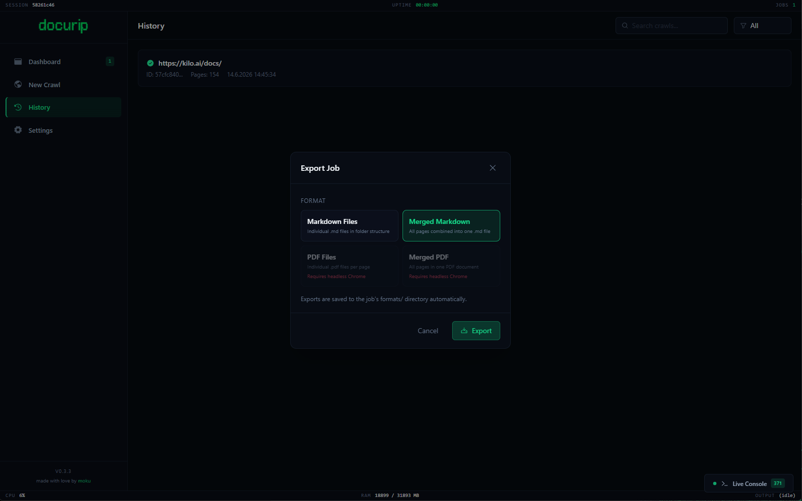

<div align="center">
  

  <br />
  <br />

  <strong>Turn any documentation site into a clean, offline Markdown archive.</strong>

  <br />

  <em>Strip boilerplate HTML. Save up to 12.6× on LLM tokens.</em>

  <br />
  <br />

  [](CHANGELOG.md)
  [](LICENSE)
  [](https://github.com/MokuDev/docurip-src/releases)
  [](https://www.rust-lang.org/)
  [](https://tauri.app/)

  <br />

  [Website](https://docurip.moku.cx) · [Download](https://docurip.moku.cx/download.html) · [Changelog](https://docurip.moku.cx/changelog.html) · [Roadmap](ROADMAP.md)
</div>

---

<div align="center">
  
  
  
  
</div>

---

## What is docurip?

Docurip is a high-performance desktop app that recursively crawls documentation websites and converts them into structured, offline Markdown archives. The Rust backend handles parallel fetching, HTML-to-Markdown conversion, and asset downloads. The React frontend streams live progress and lets you browse, search, and export results — all without leaving the app.

Built for developers who want their docs available offline — for LLM context windows, RAG pipelines, air-gapped environments, or just reading without an internet connection.

---

## Why Markdown?

If your goal is LLM training, fine-tuning, or RAG, raw HTML is your enemy. Clean Markdown is your secret weapon.

```
RAW HTML        12,000 tokens/page   ████████████████████  100%
CLEAN MARKDOWN   5,000 tokens/page   ████████             40%  — 58% saved
```

| | |
|---|---|
| **Up to 60% fewer tokens** | HTML boilerplate stripped entirely — 12M tokens of raw docs shrinks to 5M tokens of clean Markdown |
| **58% cheaper API calls** | Pay less for embeddings, fine-tuning, context window storage, and batch inference |
| **2.5× faster processing** | 1,000 HTML pages at 100k t/s: 120 s raw vs. 50 s clean Markdown |
| **50–75% less disk space** | 1 GB HTML archive → 250–500 MB; redundant scripts and styling classes gone |
| **Up to 12.6× with prompt caching** | Load clean MD once, cache with Anthropic Prompt Caching — subsequent reads cost 90% less |

### Better for training & RAG

When an LLM trains on raw HTML, it wastes capacity learning layout noise (`<div class="admonition">`, CSS classes, navigation). Clean Markdown gives models 100% signal — code blocks, APIs, headers.

For RAG, standard text splitters break arbitrarily on HTML tags, splitting code blocks mid-syntax. Markdown-based splitting natively understands document headers, keeping methods and descriptions in a single context block — better embeddings, more accurate retrieval.

**Real-world benchmark — complete Python documentation:**
`~35M tokens (Markdown)` vs. `~80M tokens (HTML)` — **55% less overhead, 2.2× faster** processing, zero layout noise in the training set.

**React.dev example:** a single page goes from `42,300 tokens` (raw HTML with nav, sidebar, hydration scripts) to `4,800 tokens` (semantic Markdown). Across 200 pages with prompt caching: `200 × 5K × 1.9 cache multiplier = 1.9M tokens` vs. 60M raw.

### How the savings stack

| Step | Mechanism | Saving |
|------|-----------|--------|
| **Strip boilerplate** | 70–90% of a docs page is nav, sidebar, footer, scripts. Docurip strips it all — ~80–150 KB HTML becomes ~10–25 KB Markdown | **5–10× fewer tokens per page** |
| **Load once** | Live-fetch tools re-crawl on every query, paying the full HTML price each time. Docurip's Merged MD loads once into context | **no redundant requests** |
| **Cache repeats** | Anthropic's prompt cache reads cost ~10% of normal input tokens — cache the Merged MD once and every subsequent query drops to micro-cents | **90% cost reduction on repeats** |

---

## Features

> Runs native. Blazing fast. A documentation harvester optimized for speed, cleanliness, and developer experience — built with Rust + Tauri.

### Extraction Engine

Never lose context to the upstream. Set a start URL, crawl depth, and page limit. Docurip walks the site in parallel via an async I/O pool, respects `robots.txt` by default, and spins up headless Chrome on demand for JS-rendered apps.

| | |
|---|---|
| **Parallel fetching** | Semaphore-bounded concurrency (configurable, default 3) with a shared `reqwest` connection pool |
| **Headless Chrome** | On-demand for CSR apps (VitePress, Docusaurus, Nextra); strategies: `never`, `auto`, `always` |
| **robots.txt compliance** | Fetches and parses `/robots.txt`, honors `User-agent`, `Disallow`, `Allow`, `Crawl-delay` — built-in |
| **Domain-locked** | Never wanders off-site — `stayWithinDomain` enforced by default |
| **Pause / Resume / Cancel** | Soft-pause via atomics — in-flight requests finish gracefully before stopping |
| **Automatic retry** | Exponential backoff for transient errors (timeouts, 5xx); permanent errors (4xx) fail immediately |
| **Disk-error auto-pause** | Detects permission errors, full disks, read-only filesystems — pauses so you can fix and resume |
| **Depth & page limits** | `maxDepth` (1–10) and `pageLimit` (1–10,000) prevent runaway crawls |

### Real-time Monitoring

An integrated console drawer streams every fetch request, network connection, and file write as it happens — debug bottlenecks or see exactly where the crawler is walking the documentation tree.

- **Live velocity speedometer** — pages/min updated in real time
- **Streaming console logger** — color-coded `✅` success · `⚠️` warning · `❌` error
- **pause, resume, retry, cancel** — full control without restarting

### Result Browser

Explore your archive instantly. Built-in debounced full-text search finds files by content. A sandboxed preview pane renders Markdown with syntax-highlighted code blocks, sanitized through DOMPurify.

- **Instant full-text search** — 200 ms debounce, filters by title, path, or content
- **Sandboxed Markdown preview** — DOMPurify sanitized, `javascript:` URIs blocked
- **Hierarchical folder navigation** — collapsible tree mirroring the site's URL structure

### Safety Systems

> Built to behave. Engineered to protect your network, respect targets, and safeguard local disk space.

| | |
|---|---|
| **Domain Lock** | Locks crawling to your target host — never drifts into external ad networks, vendor blogs, or partner sites |
| **SSRF Protection** | Blocks localhost, RFC 1918 private ranges, link-local, IPv6 ULA, and `.local` TLD at launch — no accidental internal hits |
| **Hardened CSP** | No `unsafe-inline` scripts; HTML sanitized through DOMPurify; preview pane sandboxed with strict capabilities |
| **Disk Guard** | Pauses on disk full, permission denied, or read-only errors — fix the issue, hit Resume, keep your progress |
| **Asset safety** | 50 MB size cap, MIME-type allow-list, path sanitization, directory-traversal prevention |

### Export Pipeline

> Stitch, compress, and ship anywhere. No proprietary database — exports documentation exactly how you want it.

One click compiles your archive into separate Markdown files, a consolidated handbook, standard PDFs, or a portable ZIP. The pipeline handles link rewriting so all internal references work offline, and hashes, deduplicates, and downloads images, styles, and fonts locally.

| Format | Description |
|--------|-------------|
| **MD Files** | Individual `.md` files with automatic link rewriting — all internal refs work offline |
| **Merged MD** | All pages as one file — RAG-ready structured output, load once into LLM context |
| **PDF Files** | Per-page PDF via headless Chrome |
| **Merged PDF** | All pages as a single searchable PDF |
| **ZIP** | Full output archive with asset deduplication & hashing |

---

## Quick Start

Download the latest installer — free, no account required:

**[Download docurip](https://docurip.moku.cx/download.html)**

---

## Build from Source

**Prerequisites:** Rust 1.95+, Node.js 22+, Windows with WebView2 (bundled with modern Windows)

```bash
git clone https://github.com/MokuDev/docurip
cd docurip
npm install

# Development (hot-reload)
npm run tauri dev

# Production build
npm run tauri build

# With headless Chrome — enables JS-rendered page fetching and PDF export
npm run tauri build -- --features headless
```

```bash
# Run Rust tests
cd src-tauri && cargo test

# Lint frontend
npm run lint
```

---

## Usage

### 1. Configure Settings

Before your first crawl, open **Settings** and set:
- **Output directory** — where crawled content is saved (default: `~/.docurip`)
- **Concurrency** — parallel requests (lower if you hit 429s)
- **Request delay** — milliseconds between requests (raise for rate-limited hosts)

### 2. Start a Crawl

Go to **New Crawl**, paste a docs URL, tune depth/page limits, and click **Start Crawl**.

The live console shows each page in real time. Use **Pause** if you see a spike of rate-limit errors, wait a moment, then **Resume**.

### 3. Browse & Export

In **History**, select any completed job to:
- **Browse Results** — search and preview all captured pages
- **Export** — choose a format; output lands automatically in the job's folder
- **Open Output Folder** — opens the `main/` subfolder directly in Explorer

### Output folder layout

```
~/.docurip/
└── {domain}/
    ├── main/       ← crawled Markdown + downloaded assets
    ├── zip/        ← ZIP archives
    └── formats/    ← MD files · PDF files · merged exports
```

---

## Recipes

### LLM / RAG context

```
Crawl docs site → Export as Merged MD → paste into LLM context or load into your RAG pipeline
```

The `---` separators between pages are natural chunk boundaries for text splitters. Clean Markdown cuts token usage by ~58% vs. raw HTML and keeps code blocks intact — no mid-syntax splits, better embeddings, more accurate retrieval.

**With Anthropic Prompt Caching:** load the Merged MD once, cache it, and pay ~90% less on every subsequent read. At 1,000 pages, that's 120M tokens (raw HTML, 10 queries) → 9.5M tokens — a **12.6× reduction**.

### Large sites (500+ pages)

```
Concurrency: 8  |  Request delay: 200 ms  |  Max depth: 3  |  Page limit: 500
```
If you see 429 errors, lower concurrency to 2 and raise the delay to 1000 ms.

### JS-rendered docs (VitePress, Docusaurus, Nextra)

Build with `--features headless` and set **Headless Strategy** to `always` in Settings. Expect ~5–10× slower throughput — keep concurrency at 2–3.

### Offline PDF archive

Crawl the site, then **Export → Merged PDF**. One searchable PDF containing all pages. Requires the headless build.

---

## Tech Stack

| Layer | Technology |
|-------|-----------|
| Backend | Rust 1.95+, Tauri v2, tokio, reqwest, scraper, html2md, pulldown-cmark |
| Frontend | React 19, TypeScript 5, Vite 6, Tailwind CSS 3.4, framer-motion |
| Tauri Plugins | shell, fs, dialog, store, updater |
| System | sysinfo, uuid, DOMPurify |
| Optional | headless_chrome (behind `--features headless`) |

---

## Roadmap

| Version | Focus |
|---------|-------|
| **v0.4** | Foundations — stability, test coverage, memory bounds, backpressure |
| **v0.5** | Import — PDF → Markdown, ePub → Markdown |
| **v0.6** | UX & Automation — scheduled crawls, URL rules, full-text search improvements, optional OCR |
| **v0.7** | Distribution — robust installer, auto-updater, macOS/Linux build preparation |
| **v1.0** | CLI mode, 5k-page crawls, stable release |

Full plan in [ROADMAP.md](ROADMAP.md).

---

## Contributing

Issues and pull requests are welcome. Please run `cargo test` and `npm run lint` before opening a PR.

---

## License

MIT — see [LICENSE](LICENSE).

---

<div align="center">
  <strong>Ready to rip?</strong> · Free · No account required<br /><br />
  Made with love by <a href="https://moku.cx">moku</a>
</div>
